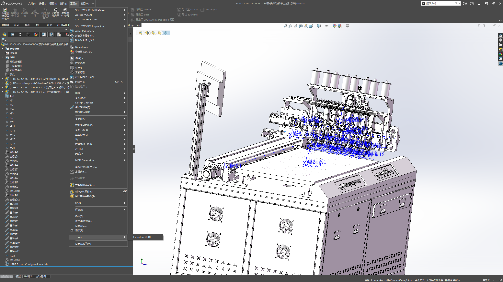

# 1.使用sw插件导出urdf文件
插件名称:sw_urdf_exporter  https://github.com/ros/solidworks_urdf_exporter/releases
插件位置:
插件使用方法:
        1.首先为所有需要运动的部分建立原点和坐标系，x轴方向为设备的正方向，z轴向上
            
            
        2.为所有可运动部分建立运动轴
            
        3.以上步骤中的运动轴，原点和坐标系使用图中的基准轴，点和坐标系
            
        4.打开插件，第一个方框输入该部分名称（base_link一般不做更改），第二个方框选择该部分的坐标系，第三个方框选择该部分的模型（右边的蓝色区域为选中模型），第四个方框选择子组件数量（就是与其直接连接的组件个数，当修改熟料之后会在最下方的方框中出现子组件）
            
        5.双击出现的子组件，打开子组件界面，第一个方框与上述相同，第二个方框为该部分电机的名称（运动副名称），第三个方框选择该部分的坐标系，第四个方框选择该部分的运动轴，第五个方框选择该部分的运动方式（选择运动轴是转动方式还是滑动或其他运动方式），第六个方框选择该部分的模型（右边的蓝色区域为选中模型），第七个方框选择子组件数量（就是与其直接连接的组件个数，当修改熟料之后会在最下方的方框中出现子组件）
            
            
            从上到下分别是自动识别，高副，转动副，移动副和固定副
        6.之后所有的子组件操作方式与第五步相同，直到完整所有组件
        7.再完成并检查无误之后，点击Preview and Export...再次检查，该插件会自动生成各部分的质量以及惯性矩阵，无需手动修改，之后点击Export URDF and Meshes进行文件导出（需要修改名字要不然名字会太长）
2.新建webots工程文件:
        1.打开webots新建工程文件，在下图这一步只勾选第一个
            
3.文件转换:
        1.得到sw插件导出的文件之后，将其拷贝到webots工程文件的protos目录下
            
        2.在该文件目录下打开终端使用pip install urdf2webots命令安装文件转换插件（需要先安装python，且python版本需要 Python 3.5 或更高版本）
            
        3.插件安装完成后，使用python -m urdf2webots.importer --input=（urdf文件绝对路径）命令导出proto文件
            
4.导入webots:  
        1.打开刚才新建的webots工程，点击上方的暂停键，删除世界中的背景，之后再3D框中右键点击新增
            
            
            
            
        2.在搜索框中搜索floor，之后点击我选中的地面
            
        3.再次新增，搜索light，添加完成后如下所示
            
            
        4.添加设备模型，点击新增，选择图中的这个，名字为导出urdf时的文件名字
            
            
        5.右键Text，选择图中的选项，将其转化为robot节点
            
            
        6.打开如下位置，检查STL文件位置是否正确，子组件的模型位置如下
            
            
        7.检查所有可运动组件的这个参数，1为其运动方向会旋转轴，区域方向修改为0
            
        8.对所有子组件进行检查确保无误。
        9.删除设备base的物料属性，使设备固定在地面
            
        10.控制器的名称选择控制代码文件的名称，如果没有写就不会显示
            
        9.控制代码，使用如下代码即可实现控制
            #include <webots/Robot.hpp>
            #include <webots/Motor.hpp>
            #include <webots/PositionSensor.hpp>
            #include <winsock2.h>
            #include <iostream>
            #include <string>
            #include <sstream>

            #pragma comment(lib, "ws2_32.lib")

            using namespace webots;
            using namespace std;

            int main(int argc, char **argv) 
            {
                // --- 1. Webots 初始化 ---
                Robot *robot = new Robot();
                int timeStep = (int)robot->getBasicTimeStep();
                

                const int MOTOR_COUNT = 3;
                double targetPositions[MOTOR_COUNT] = {0.0, 0.0, 0.0};
                const double TOLERANCE = 0.0001; // 容差：0.01 弧度（约 0.5 度）
                string motorNames[MOTOR_COUNT] = {"middle_joint", "arm_joint", "hand_joint"};
                Motor *motors[MOTOR_COUNT];
                PositionSensor *sensors[MOTOR_COUNT];

                for (int i = 0; i < MOTOR_COUNT; i++) 
                {
                    motors[i] = robot->getMotor(motorNames[i]);
                    sensors[i] = robot->getPositionSensor(motorNames[i] + "_sensor"); // 假设传感器名为电机名+_sensor
                    
                    if (motors[i]) 
                    {
                        // 注意：这里不再设置 setPosition(INFINITY)
                        // 默认就是位置控制模式
                        motors[i]->setVelocity(1.0); // 设置转动到目标位置时的最大速度
                    }
                    if (sensors[i]) 
                    {
                        sensors[i]->enable(timeStep);
                    }
                    
                }

                // --- 2. TCP Server 初始化 ---
                WSADATA wsaData;
                WSAStartup(MAKEWORD(2, 2), &wsaData);
                SOCKET serverSock = socket(AF_INET, SOCK_STREAM, 0);
                sockaddr_in serverAddr;
                serverAddr.sin_family = AF_INET;
                serverAddr.sin_addr.s_addr = INADDR_ANY;
                serverAddr.sin_port = htons(10001);
                bind(serverSock, (sockaddr*)&serverAddr, sizeof(serverAddr));
                listen(serverSock, 1);
                u_long mode = 1;
                ioctlsocket(serverSock, FIONBIO, &mode);

                cout << "角度控制服务器已启动 [位置模式]..." << endl;

                SOCKET clientSock = INVALID_SOCKET;

                // --- 3. 循环 ---
                bool alreadyAnnounced = true; // 初始为 true，防止启动时乱发
                while (robot->step(timeStep) != -1) 
                {
                    
                    if (clientSock == INVALID_SOCKET) 
                    {
                        clientSock = accept(serverSock, NULL, NULL);
                        if (clientSock != INVALID_SOCKET) 
                        {
                            cout << "客户端已连接" << endl;
                            ioctlsocket(clientSock, FIONBIO, &mode);
                        }
                    } 
                    else 
                    {
                        char buffer[512] = {0};
                        int bytes = recv(clientSock, buffer, 512, 0);
                        if (bytes > 0) 
                        {
                            alreadyAnnounced = false;
                            string data(buffer);
                            stringstream ss(data);
                            int idx = 0;
                            string segment;
                            
                            while (getline(ss, segment, ',') && idx < MOTOR_COUNT)
                            {
                                try 
                                {
                                    
                                    double targetPos = stod(segment); // 这里的数值代表弧度

                                    if (motors[idx]) 
                                    {
                                        // 核心修改：设置目标位置
                                        targetPositions[idx]=targetPos;
                                        motors[idx]->setPosition(targetPos);
                                        cout << "电机 " << motorNames[idx] << " 移动到角度: " << targetPos << endl;
                                    }  
                                        
                                } 
                                catch (...) 
                                { 
                                    cout << "格式错误" << endl; 
                                }
                                idx++;
                            }
                            
                        } 
                        else if (bytes == 0 || (bytes == SOCKET_ERROR && WSAGetLastError() != WSAEWOULDBLOCK)) 
                        {
                            closesocket(clientSock);
                            clientSock = INVALID_SOCKET;
                        }
                    
                        bool isMoving = false;
                        string feedback = "STATUS:";
                        for (int i = 0; i < MOTOR_COUNT; i++) 
                        {
                            double currentVal = sensors[i]->getValue(); // 读取传感器实时弧度
                            feedback += to_string(currentVal) + (i < MOTOR_COUNT - 1 ? "," : ""); // 用逗号分隔
                            if (abs(currentVal - targetPositions[i]) > TOLERANCE) 
                            {
                                isMoving = true;
                            }
                        }
                        if (isMoving) 
                        {
                            send(clientSock, feedback.c_str(), (int)feedback.length(), 0);
                            cout << isMoving <<" "<< "[Webots 实时角度反馈 (rad)]: " << feedback << endl;
                            alreadyAnnounced = false;
                        }
                        else if(!alreadyAnnounced)
                        {
                            // 到达目标点，发送一次“已到达”信号
                            string arrived = "ARRIVED";
                            send(clientSock, arrived.c_str(), (int)arrived.length(), 0);
                            //cout << isMoving <<" "<< "[Webots 实时角度反馈 (rad)]: " << feedback <<" " << arrived << endl;
                            alreadyAnnounced = true;
                        } 
                    }
                    
                }

                closesocket(serverSock);
                WSACleanup();
                delete robot;
                return 0;
            }
